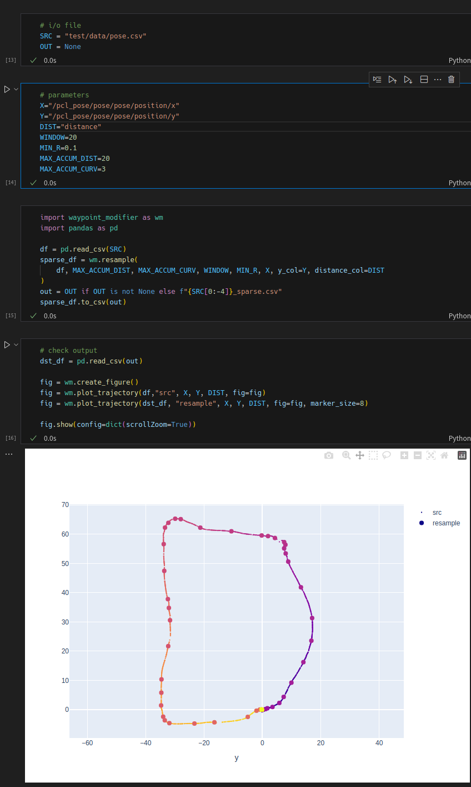

# waypoint modifier

waypoint を編集するツール

## 前提環境

- python (>=3.10)
- poetry ([インストール方法](https://python-poetry.org/docs/#installing-with-pipx))

## インストール

```shell
poetry install
```

## 点列の編集

各 jupyter notebook を実行することで点列を編集できる。notebook は最初のセルに入出力ファイル名、次のセルに実行パラメータが書かれているため、それを修正した上で実行する。

notebook はコピーして (`waypoint_modifier` がインストールされた環境であれば) 任意の場所に置くことができる。

### resample.ipynb

resample では点列を、距離及び曲率を使って間引く。0番目の点から走査していき、以下のOR条件を満たした時にその点を採用する。

- 点の間隔の累和が `MAX_ACCUM_DIST` を越えた時
- 曲率の累和が `MAX_ACCUM_CURV` を越えた時

ただし、 停止時に点が重複するのを除去するために `MIN_ACCUM_DIST` 以上の距離を走行していることを制約に加えている。


